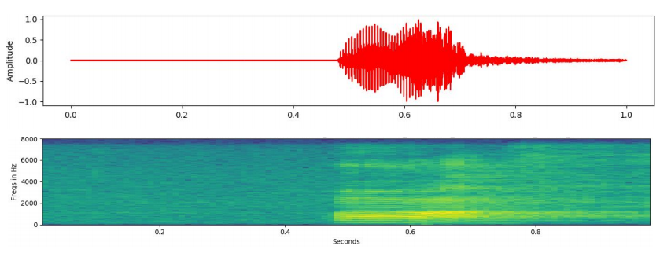
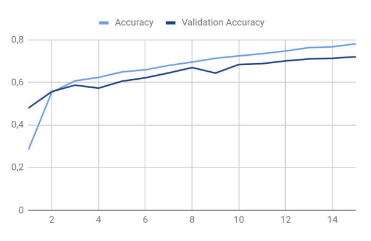
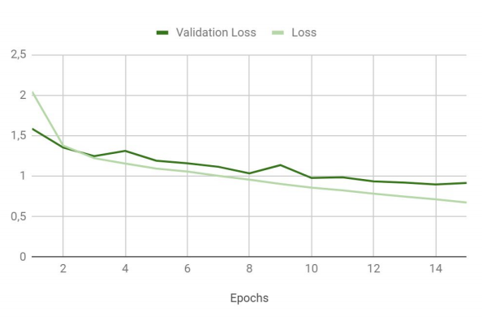
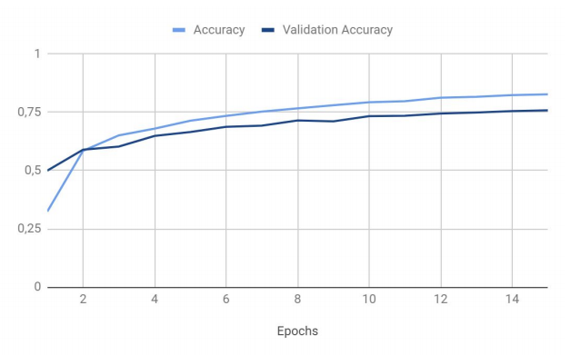
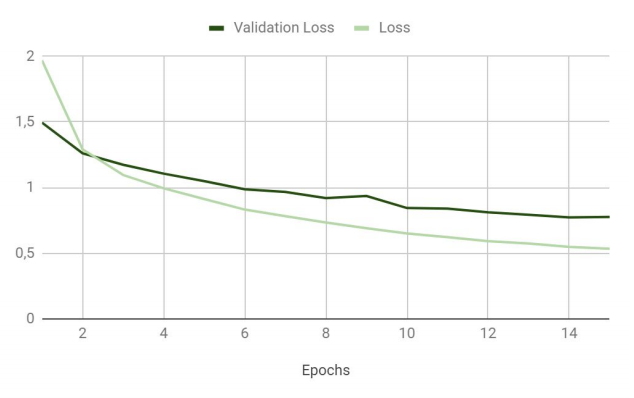
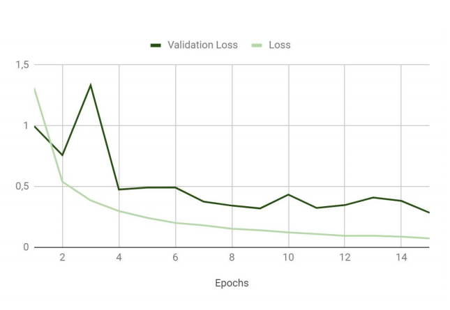
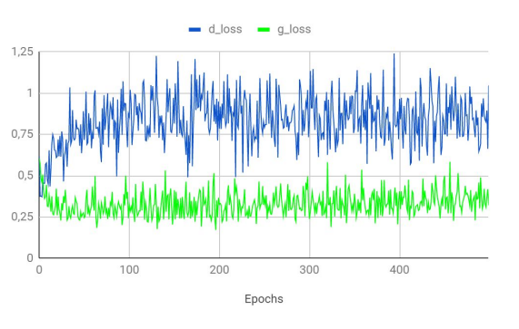

# Speech Recognition - CNN and GAN
Convolutional Neural Network and Generative Adversarial Network for Speech Recognition

## Table of contents
* [Technologies](#technologies)
* [Results](#Results)

## Technologies
* Python 3.7
* Tensorflow 1.13.1
* Speech Commands Dataset (http://download.tensorflow.org/data/speech_commands_v0.01.tar.gz)

## Results
Wave signal and spectrogram of the sample audio file from Speech Commands Dataset

Results of classifier with 78% correctness

Results of classifier with 83% correctness

Results of classifier with 92% correctness

Results of generative adversarial network using discriminator loss and generator loss

